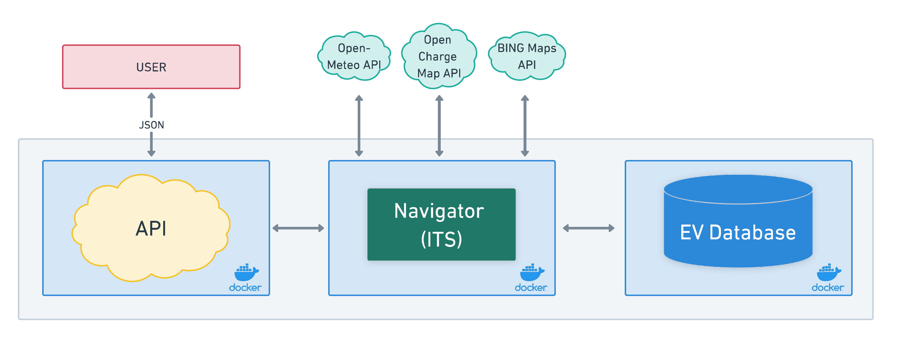

# EV-Navigator Microservice

**EV (Electric Vehicle)-Navigator** is an Intelligent Transport System microservice that orchestrates the search for optimal EV charging stations around the user's destination.

The microservice is composed by 3 main components:
- **Navigator** (main code)
- **Built-in API** (user interaction)
- **Database** (storage of EV parameters)




Each component is housed in its own Docker container. The microservice also integrates with external APIs to deliver road, weather, elevation, and charging data, while precisely estimating your EV's State of Charge (SoC).


## Features
- Integrates with external APIs for road, weather, elevation and charging station data.
- Estimates the State of Charge (SoC) for EVs.
- Utilizes Docker for simplified orchestration of services.

## Quickstart
1. Clone the repository.
2. Use `docker-compose up` to start the services.
3. Send a POST request to the API at "http://localhost:8002/process_data" with necessary parameters.

## Usage Example
Send a POST request with the following JSON payload structure:
```json
{
  "origin_location": "CityA",
  "destination_location": "CityB",
  "max_radius": 50 ,
  "ev_model": "Nissan Leaf",
  "initial_SOC": 80,
  "fast_charging_priority": true
}
```

### Repository Structure

- `docker-compose.yml`: Docker Compose file to orchestrate the containers.
- `init.sql`: SQL file to initialize the database.
- `navigator/`: Folder containing the main application.
  - `main.py`: Main application logic.
  - `Dockerfile`: Dockerfile for the application.
  - `requirements.txt`: Required Python packages.
- `api/`: Folder containing the API.
  - `api.py`: API server code.
  - `Dockerfile`: Dockerfile for the application.
  - `requirements.txt`: Required Python packages.

### Built With

- Python
- MySQL
- Docker
- FastAPI
- External APIs (Nominatim, Open-Meteo, Open Charge Map, Bing Maps)

### Setup

All Python package dependencies are listed in `requirements.txt` and can be installed using pip.

```bash
pip install -r requirements.txt
```
### Author
**Fernando Pintado** - *Initial Creator and Developer* - [Github Profile](https://github.com/ferpintado99)

### License
This project is licensed under the MIT License. For more details, please refer to the [LICENSE](https://github.com/ferpintado99/EV-Navigator/blob/main/LICENSE) file in the repository.


